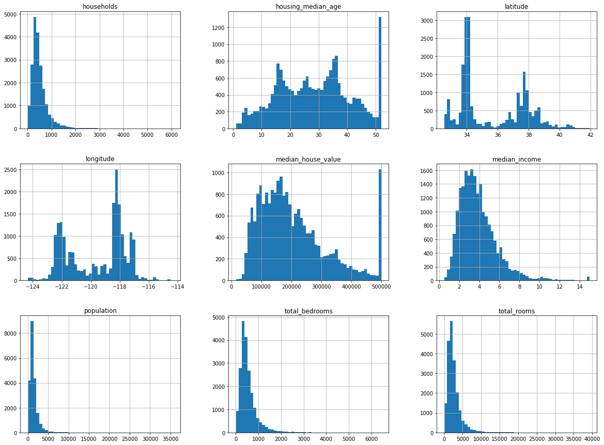
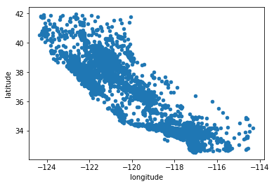
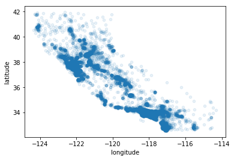
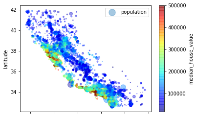
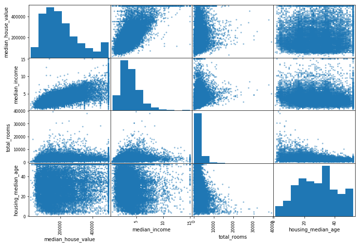
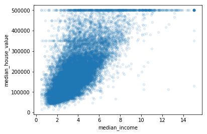

# 房产信息机器学习项目-学习笔记

## 一、加载并简单了解数据
#### 获取数据的函数：调用fetch_housing_data()，就会在工作空间创建一个datasets/housing目录，下载housing.tgz文件，解压出housing.csv


```python
import os
import tarfile
from six.moves import urllib

DOWNLOAD_ROOT = "https://raw.githubusercontent.com/ageron/handson-ml/master/"
HOUSING_PATH = "datasets/housing"
HOUSING_URL = DOWNLOAD_ROOT + HOUSING_PATH + "/housing.tgz"

def fetch_housing_data(housing_url=HOUSING_URL, housing_path=HOUSING_PATH):
    if not os.path.isdir(housing_path):
        os.makedirs(housing_path)
    tgz_path = os.path.join(housing_path, "housing.tgz")
    urllib.request.urlretrieve(housing_url, tgz_path)
    housing_tgz = tarfile.open(tgz_path)
    housing_tgz.extractall(path=housing_path)
    housing_tgz.close()
```


```python
fetch_housing_data()
```

#### 使用Pandas加载数据的函数


```python
import pandas as pd

def load_housing_data(housing_path=HOUSING_PATH):
    csv_path = os.path.join(housing_path, "housing.csv")
    return pd.read_csv(csv_path)
```


```python
housing = load_housing_data()
```

#### 上面已经将数据加载到一个包含所有数据的 Pandas DataFrame 对象：housing，现在可以简略查看一下数据


```python
housing.head()
```


<div>
<style scoped>
    .dataframe tbody tr th:only-of-type {
        vertical-align: middle;
    }

    .dataframe tbody tr th {
        vertical-align: top;
    }

    .dataframe thead th {
        text-align: right;
    }
</style>
<table border="1" class="dataframe">
  <thead>
    <tr style="text-align: right;">
      <th></th>
      <th>longitude</th>
      <th>latitude</th>
      <th>housing_median_age</th>
      <th>total_rooms</th>
      <th>total_bedrooms</th>
      <th>population</th>
      <th>households</th>
      <th>median_income</th>
      <th>median_house_value</th>
      <th>ocean_proximity</th>
    </tr>
  </thead>
  <tbody>
    <tr>
      <th>0</th>
      <td>-122.23</td>
      <td>37.88</td>
      <td>41.0</td>
      <td>880.0</td>
      <td>129.0</td>
      <td>322.0</td>
      <td>126.0</td>
      <td>8.3252</td>
      <td>452600.0</td>
      <td>NEAR BAY</td>
    </tr>
    <tr>
      <th>1</th>
      <td>-122.22</td>
      <td>37.86</td>
      <td>21.0</td>
      <td>7099.0</td>
      <td>1106.0</td>
      <td>2401.0</td>
      <td>1138.0</td>
      <td>8.3014</td>
      <td>358500.0</td>
      <td>NEAR BAY</td>
    </tr>
    <tr>
      <th>2</th>
      <td>-122.24</td>
      <td>37.85</td>
      <td>52.0</td>
      <td>1467.0</td>
      <td>190.0</td>
      <td>496.0</td>
      <td>177.0</td>
      <td>7.2574</td>
      <td>352100.0</td>
      <td>NEAR BAY</td>
    </tr>
    <tr>
      <th>3</th>
      <td>-122.25</td>
      <td>37.85</td>
      <td>52.0</td>
      <td>1274.0</td>
      <td>235.0</td>
      <td>558.0</td>
      <td>219.0</td>
      <td>5.6431</td>
      <td>341300.0</td>
      <td>NEAR BAY</td>
    </tr>
    <tr>
      <th>4</th>
      <td>-122.25</td>
      <td>37.85</td>
      <td>52.0</td>
      <td>1627.0</td>
      <td>280.0</td>
      <td>565.0</td>
      <td>259.0</td>
      <td>3.8462</td>
      <td>342200.0</td>
      <td>NEAR BAY</td>
    </tr>
  </tbody>
</table>
</div>


```python
housing.info()
```

    <class 'pandas.core.frame.DataFrame'>
    RangeIndex: 20640 entries, 0 to 20639
    Data columns (total 10 columns):
    longitude             20640 non-null float64
    latitude              20640 non-null float64
    housing_median_age    20640 non-null float64
    total_rooms           20640 non-null float64
    total_bedrooms        20433 non-null float64
    population            20640 non-null float64
    households            20640 non-null float64
    median_income         20640 non-null float64
    median_house_value    20640 non-null float64
    ocean_proximity       20640 non-null object
    dtypes: float64(9), object(1)
    memory usage: 1.6+ MB


#### 上面可以注意的信息有：1.total_bedrooms        20433，少于总房间数，说明有些实例缺少这个值

#### value_counts()方法查看该项中都有哪些类别，如离大海距离是有限个离散值的属性，表示实例的某项类别；describe()方法展示了数值属性的概括


```python
housing["ocean_proximity"].value_counts()
```


    <1H OCEAN     9136
    INLAND        6551
    NEAR OCEAN    2658
    NEAR BAY      2290
    ISLAND           5
    Name: ocean_proximity, dtype: int64


```python
housing.describe()
```


<div>
<style scoped>
    .dataframe tbody tr th:only-of-type {
        vertical-align: middle;
    }

    .dataframe tbody tr th {
        vertical-align: top;
    }

    .dataframe thead th {
        text-align: right;
    }
</style>
<table border="1" class="dataframe">
  <thead>
    <tr style="text-align: right;">
      <th></th>
      <th>longitude</th>
      <th>latitude</th>
      <th>housing_median_age</th>
      <th>total_rooms</th>
      <th>total_bedrooms</th>
      <th>population</th>
      <th>households</th>
      <th>median_income</th>
      <th>median_house_value</th>
    </tr>
  </thead>
  <tbody>
    <tr>
      <th>count</th>
      <td>20640.000000</td>
      <td>20640.000000</td>
      <td>20640.000000</td>
      <td>20640.000000</td>
      <td>20433.000000</td>
      <td>20640.000000</td>
      <td>20640.000000</td>
      <td>20640.000000</td>
      <td>20640.000000</td>
    </tr>
    <tr>
      <th>mean</th>
      <td>-119.569704</td>
      <td>35.631861</td>
      <td>28.639486</td>
      <td>2635.763081</td>
      <td>537.870553</td>
      <td>1425.476744</td>
      <td>499.539680</td>
      <td>3.870671</td>
      <td>206855.816909</td>
    </tr>
    <tr>
      <th>std</th>
      <td>2.003532</td>
      <td>2.135952</td>
      <td>12.585558</td>
      <td>2181.615252</td>
      <td>421.385070</td>
      <td>1132.462122</td>
      <td>382.329753</td>
      <td>1.899822</td>
      <td>115395.615874</td>
    </tr>
    <tr>
      <th>min</th>
      <td>-124.350000</td>
      <td>32.540000</td>
      <td>1.000000</td>
      <td>2.000000</td>
      <td>1.000000</td>
      <td>3.000000</td>
      <td>1.000000</td>
      <td>0.499900</td>
      <td>14999.000000</td>
    </tr>
    <tr>
      <th>25%</th>
      <td>-121.800000</td>
      <td>33.930000</td>
      <td>18.000000</td>
      <td>1447.750000</td>
      <td>296.000000</td>
      <td>787.000000</td>
      <td>280.000000</td>
      <td>2.563400</td>
      <td>119600.000000</td>
    </tr>
    <tr>
      <th>50%</th>
      <td>-118.490000</td>
      <td>34.260000</td>
      <td>29.000000</td>
      <td>2127.000000</td>
      <td>435.000000</td>
      <td>1166.000000</td>
      <td>409.000000</td>
      <td>3.534800</td>
      <td>179700.000000</td>
    </tr>
    <tr>
      <th>75%</th>
      <td>-118.010000</td>
      <td>37.710000</td>
      <td>37.000000</td>
      <td>3148.000000</td>
      <td>647.000000</td>
      <td>1725.000000</td>
      <td>605.000000</td>
      <td>4.743250</td>
      <td>264725.000000</td>
    </tr>
    <tr>
      <th>max</th>
      <td>-114.310000</td>
      <td>41.950000</td>
      <td>52.000000</td>
      <td>39320.000000</td>
      <td>6445.000000</td>
      <td>35682.000000</td>
      <td>6082.000000</td>
      <td>15.000100</td>
      <td>500001.000000</td>
    </tr>
  </tbody>
</table>
</div>


#### 也可以画出柱状图查看数据


```python
%matplotlib inline
import matplotlib.pyplot as plt
housing.hist(bins=50, figsize=(20,15))
plt.show()
```





## 二、创建测试集

1. 若是每次随机挑选一些实例，一般是数据集的 20%，放到一边：当再次运行程序，就会产生一个不同的测试集。多次运行之后，机器学习算法就会得到整个数据集，这是需要避免的。
2. 若是在调用np.random.permutation()之前，设置随机数生成器的种子，以产生总是相同的洗牌指数（shuffled indices）。可以避免1.的问题，但是如果数据集更新，这两个方法都会失效。
3. 通常的解决方案是通过每个实例的ID来判定这个实例是否应该放入测试集，这样可以保证在多次运行中，测试集保持不变，即使更新了数据集。新的测试集会包含新实例中的 20%，但不会有之前位于训练集的实例。


```python
import hashlib

def test_set_check(identifier, test_ratio, hash):
    return hash(np.int64(identifier)).digest()[-1] < 256 * test_ratio

def split_train_test_by_id(data, test_ratio, id_column, hash=hashlib.md5):
    ids = data[id_column]
    in_test_set = ids.apply(lambda id_: test_set_check(id_, test_ratio, hash))
    return data.loc[~in_test_set], data.loc[in_test_set]
```


```python
import numpy as np
```

1. 由于房产数据集没有ID这一列，使用行索引作为ID。但是如果使用行索引作为唯一识别码，需要保证新数据都放到现有数据的尾部，且没有行被删除。
2. 如果做不到，则可以用最稳定的特征来创建唯一识别码。例如，一个区的维度和经度在几百万年之内是不变的，所以可以将两者结合成一个ID。

#### 但以上都是纯随机的取样方法。当数据集很大时（尤其是和属性数相比），这通常可行；但如果数据集不大，就会有采样偏差的风险。
- 现在考虑分层采样：收入中位数是预测房价中位数非常重要的属性，想要尽量使测试集可以代表整体数据集中的多种收入分类。
- 由于收入中位数是一个连续的数值属性，创建一个值是离散分布的收入类别属性“income_cat”：将收入中位数除以1.5（以限制收入分类的数量），用ceil对值舍入（以产生离散的分类），然后将所有大于5的分类归入到分类5


```python
housing["income_cat"] = np.ceil(housing["median_income"] / 1.5)
housing["income_cat"].where(housing["income_cat"] < 5, 5.0, inplace=True)
```

#### 现在，使用Scikit-Learn的StratifiedShuffleSplit类进行分层采样


```python
from sklearn.model_selection import StratifiedShuffleSplit

split = StratifiedShuffleSplit(n_splits=1, test_size=0.2, random_state=42)

for train_index, test_index in split.split(housing, housing["income_cat"]):
    strat_train_set = housing.loc[train_index]
    strat_test_set = housing.loc[test_index]
```

#### 检查下结果是否符合预期。在完整的房产数据集、测试集、训练集中查看收入分类比例：


```python
housing["income_cat"].value_counts() / len(housing)
```


    3.0    0.350581
    2.0    0.318847
    4.0    0.176308
    5.0    0.114438
    1.0    0.039826
    Name: income_cat, dtype: float64


```python
strat_train_set["income_cat"].value_counts() / len(strat_train_set)
```


    3.0    0.350594
    2.0    0.318859
    4.0    0.176296
    5.0    0.114402
    1.0    0.039850
    Name: income_cat, dtype: float64


```python
strat_test_set["income_cat"].value_counts() / len(strat_test_set)
```


    3.0    0.350533
    2.0    0.318798
    4.0    0.176357
    5.0    0.114583
    1.0    0.039729
    Name: income_cat, dtype: float64


#### 可以看到分层抽样后，测试集的收入分类比例与总数据集几乎相同。

#### 现在删除income_cat属性，使数据回到初始状态


```python
for set in (strat_train_set, strat_test_set):
    set.drop(["income_cat"], axis=1, inplace=True)
```

## 三、数据探索阶段

快速查看了数据后，对要处理的数据有了整体了解，现在的目标是更深的探索数据。

首先，保证将测试集放在了一旁，只是研究训练集。

#### 1. 创建一个副本，以免损伤训练集：


```python
housing = strat_train_set.copy()
```

#### 2. 因为存在地理信息（纬度和经度），创建一个所有街区的散点图来数据可视化


```python
housing.plot(kind="scatter", x="longitude", y="latitude")
```


    <matplotlib.axes._subplots.AxesSubplot at 0x7fd78f34ec50>





#### 3. 将alpha设为 0.1，可以更容易看出数据点的密度


```python
housing.plot(kind="scatter", x="longitude", y="latitude", alpha=0.1)
```


    <matplotlib.axes._subplots.AxesSubplot at 0x7fd78f5acd30>





可以非常清楚地看到高密度区域，湾区、洛杉矶和圣迭戈，以及中央谷，特别是从萨克拉门托和弗雷斯诺。

#### 4. 调整可视化参数使房价的规律显现出来：每个圈的半径表示街区的人口（选项s），颜色代表价格（选项c，使用jet的颜色图（选项cmap），它的范围是从蓝色（低价）到红色（高价））


```python
housing.plot(kind="scatter", x="longitude", y="latitude", alpha=0.4,
    s=housing["population"]/100, label="population",
    c="median_house_value", cmap=plt.get_cmap("jet"), colorbar=True,
)
plt.legend()
```


    <matplotlib.legend.Legend at 0x7fd78f71ce80>





这张图说明房价和位置（比如，靠海）和人口密度联系密切。

#### 5. 使用corr()方法计算出每对属性间的标准相关系数，来看下每个属性和房价中位数的关联度：


```python
corr_matrix = housing.corr()
```


```python
corr_matrix["median_house_value"].sort_values(ascending=False)
```


    median_house_value    1.000000
    median_income         0.687160
    total_rooms           0.135097
    housing_median_age    0.114110
    households            0.064506
    total_bedrooms        0.047689
    population           -0.026920
    longitude            -0.047432
    latitude             -0.142724
    Name: median_house_value, dtype: float64


#### 6. 另一种检测属性间相关系数的方法是使用Pandas的scatter_matrix函数，只重点关注几个和房价中位数最有可能相关的属性：


```python
from pandas.tools.plotting import scatter_matrix

attributes = ["median_house_value", "median_income", "total_rooms",
              "housing_median_age"]
scatter_matrix(housing[attributes], figsize=(12, 8))
```

    /Users/yang/anaconda3/lib/python3.7/site-packages/ipykernel_launcher.py:5: FutureWarning: 'pandas.tools.plotting.scatter_matrix' is deprecated, import 'pandas.plotting.scatter_matrix' instead.
      """


    array([[<matplotlib.axes._subplots.AxesSubplot object at 0x7fd790abc828>,
            <matplotlib.axes._subplots.AxesSubplot object at 0x7fd790e79f28>,
            <matplotlib.axes._subplots.AxesSubplot object at 0x7fd790ea93c8>,
            <matplotlib.axes._subplots.AxesSubplot object at 0x7fd790ed19e8>],
           [<matplotlib.axes._subplots.AxesSubplot object at 0x7fd790f010b8>,
            <matplotlib.axes._subplots.AxesSubplot object at 0x7fd790f010f0>,
            <matplotlib.axes._subplots.AxesSubplot object at 0x7fd790f52dd8>,
            <matplotlib.axes._subplots.AxesSubplot object at 0x7fd790f844a8>],
           [<matplotlib.axes._subplots.AxesSubplot object at 0x7fd78ebc69b0>,
            <matplotlib.axes._subplots.AxesSubplot object at 0x7fd78eb2b7b8>,
            <matplotlib.axes._subplots.AxesSubplot object at 0x7fd78eb69128>,
            <matplotlib.axes._subplots.AxesSubplot object at 0x7fd78ec98be0>],
           [<matplotlib.axes._subplots.AxesSubplot object at 0x7fd78eacebe0>,
            <matplotlib.axes._subplots.AxesSubplot object at 0x7fd78ec895f8>,
            <matplotlib.axes._subplots.AxesSubplot object at 0x7fd78ea68080>,
            <matplotlib.axes._subplots.AxesSubplot object at 0x7fd78ec82748>]],
          dtype=object)





最有希望用来预测房价中位数的属性是收入中位数，将这张图放大：


```python
housing.plot(kind="scatter", x="median_income",y="median_house_value",
             alpha=0.1)
```


    <matplotlib.axes._subplots.AxesSubplot at 0x7fd78e535be0>





可以清晰地看到向上的趋势，呈正相关

#### 7. 给算法准备数据之前，需要做的最后一件事是尝试多种属性组合：例如，如果你不知道某个街区有多少户，该街区的总房间数就没什么用。你真正需要的是每户有几个房间。相似的，总卧室数也不重要：你可能需要将其与房间数进行比较。每户的人口数也是一个有趣的属性组合。


```python
housing["rooms_per_household"] = housing["total_rooms"]/housing["households"]
housing["bedrooms_per_room"] = housing["total_bedrooms"]/housing["total_rooms"]
housing["population_per_household"]=housing["population"]/housing["households"]
```


```python
corr_matrix = housing.corr()
corr_matrix["median_house_value"].sort_values(ascending=False)
```


    median_house_value          1.000000
    median_income               0.687160
    rooms_per_household         0.146285
    total_rooms                 0.135097
    housing_median_age          0.114110
    households                  0.064506
    total_bedrooms              0.047689
    population_per_household   -0.021985
    population                 -0.026920
    longitude                  -0.047432
    latitude                   -0.142724
    bedrooms_per_room          -0.259984
    Name: median_house_value, dtype: float64


与总房间数或卧室数相比，新的bedrooms_per_room属性与房价中位数的关联更强。显然，卧室数/总房间数的比例越低，房价就越高。每户的房间数也比街区的总房间数的更有信息，很明显，房屋越大，房价就越高。

## 四、为机器学习算法准备数据

先回到干净的训练集（通过再次复制strat_train_set），将预测量和标签分开，因为我们不想对预测量和目标值应用相同的转换（drop()创建了一份数据的备份，而不影响strat_train_set）


```python
housing = strat_train_set.drop("median_house_value", axis=1)
housing_labels = strat_train_set["median_house_value"].copy()
```

#### 1. 数据清洗

前面有提到属性total_bedrooms有一些缺失值，需要创建一些函数来处理特征缺失的问题。有几种解决选项：
- 去掉对应的街区
- 去掉整个属性
- 进行赋值（0、平均值、中位数等等）
- Scikit-Learn 提供了一个方便的类来处理缺失值：Imputer。使用方法：首先，需要创建一个Imputer实例，指定用某属性的中位数来替换该属性所有的缺失值

应用Scikit-Learn的方法，将每个数值属性的缺失值替换为中位数：


```python
from sklearn.preprocessing import Imputer
imputer = Imputer(strategy="median")
```

由于只有数值属性才能算出中位数，需要创建一份不包括文本属性ocean_proximity的数据副本，再用fit()方法将imputer实例拟合到训练数据


```python
housing_num = housing.drop("ocean_proximity", axis=1)
```


```python
imputer.fit(housing_num)
```


    Imputer(axis=0, copy=True, missing_values='NaN', strategy='median', verbose=0)


```python
imputer.statistics_
```


    array([-118.51  ,   34.26  ,   29.    , 2119.5   ,  433.    , 1164.    ,
            408.    ,    3.5409])


```python
housing_num.median().values
```


    array([-118.51  ,   34.26  ,   29.    , 2119.5   ,  433.    , 1164.    ,
            408.    ,    3.5409])


```python
X = imputer.transform(housing_num)
```


```python
housing_tr = pd.DataFrame(X, columns=housing_num.columns)
```

#### 2.处理文本和类别属性

大多数机器学习算法更喜欢和数字打交道，例如前面，我们丢弃了类别属性ocean_proximity，因为它是一个文本属性，不能计算出中位数。所以现在来把这些文本标签转换为数字。


```python
from sklearn.preprocessing import LabelEncoder
```


```python
encoder = LabelEncoder()
```


```python
housing_cat = housing["ocean_proximity"]
```


```python
housing_cat_encoded = encoder.fit_transform(housing_cat)
```


```python
housing_cat_encoded
```


    array([0, 0, 4, ..., 1, 0, 3])


```python
print(encoder.classes_)
```

    ['<1H OCEAN' 'INLAND' 'ISLAND' 'NEAR BAY' 'NEAR OCEAN']


#### 这种做法的问题是，ML 算法会认为两个临近的值比两个疏远的值要更相似。为了解决这个问题，需要将整数分类值转变为独热向量，使用Scikit-Learn提供的编码器OneHotEncoder


```python
from sklearn.preprocessing import OneHotEncoder
```


```python
encoder = OneHotEncoder()
housing_cat_1hot = encoder.fit_transform(housing_cat_encoded.reshape(-1,1))
housing_cat_1hot
```


    <16512x5 sparse matrix of type '<class 'numpy.float64'>'
    	with 16512 stored elements in Compressed Sparse Row format>


```python
housing_cat_1hot.toarray()
```


    array([[1., 0., 0., 0., 0.],
           [1., 0., 0., 0., 0.],
           [0., 0., 0., 0., 1.],
           ...,
           [0., 1., 0., 0., 0.],
           [1., 0., 0., 0., 0.],
           [0., 0., 0., 1., 0.]])


```python
from sklearn.preprocessing import LabelBinarizer
encoder = LabelBinarizer()
housing_cat_1hot = encoder.fit_transform(housing_cat)
housing_cat_1hot
```


    array([[1, 0, 0, 0, 0],
           [1, 0, 0, 0, 0],
           [0, 0, 0, 0, 1],
           ...,
           [0, 1, 0, 0, 0],
           [1, 0, 0, 0, 0],
           [0, 0, 0, 1, 0]])


```python
from sklearn.base import BaseEstimator, TransformerMixin
rooms_ix, bedrooms_ix, population_ix, household_ix = 3, 4, 5, 6

class CombinedAttributesAdder(BaseEstimator, TransformerMixin):
    def __init__(self, add_bedrooms_per_room = True): # no *args or **kargs
        self.add_bedrooms_per_room = add_bedrooms_per_room
    def fit(self, X, y=None):
        return self  # nothing else to do
    def transform(self, X, y=None):
        rooms_per_household = X[:, rooms_ix] / X[:, household_ix]
        population_per_household = X[:, population_ix] / X[:, household_ix]
        if self.add_bedrooms_per_room:
            bedrooms_per_room = X[:, bedrooms_ix] / X[:, rooms_ix]
            return np.c_[X, rooms_per_household, population_per_household,
                         bedrooms_per_room]
        else:
            return np.c_[X, rooms_per_household, population_per_household]

attr_adder = CombinedAttributesAdder(add_bedrooms_per_room=False)
housing_extra_attribs = attr_adder.transform(housing.values)
```

#### 3. 特征缩放

除了个别情况，当输入的数值属性量度不同时，机器学习算法的性能都不会好。所以数据要做的最重要的转换之一是特征缩放。注意：通常情况下我们不需要对目标值进行缩放。

有两种常见的方法可以让所有的属性有相同的量度：线性函数归一化（Min-Max scaling）和标准化（standardization）
- 线性函数归一化：值被转变、重新缩放，直到范围变成 0 到 1。先减去最小值，再除以最大值与最小值的差值，来进行归一化。Scikit-Learn提供了一个转换器MinMaxScaler来实现这个功能。
- 标准化：先减去平均值，再除以方差，使得到的分布具有单位方差。与归一化不同，标准化：1.不会限定值到某个特定的范围，这对某些算法可能构成问题（比如，神经网络常需要输入值得范围是0到1）。2.但标准化受到异常值的影响很小。
Scikit-Learn 提供了一个转换器StandardScaler来进行标准化。

#### 4.转换流水线

Scikit-Learn提供了类Pipeline


```python
from sklearn.pipeline import Pipeline
from sklearn.preprocessing import StandardScaler

num_pipeline = Pipeline([
        ('imputer', Imputer(strategy="median")),
        ('attribs_adder', CombinedAttributesAdder()),
        ('std_scaler', StandardScaler()),
        ])

housing_num_tr = num_pipeline.fit_transform(housing_num)
```

Pipeline构造器的步骤顺序列表中，除了最后一个估计器，其余都要是转换器。调用流水线的fit()方法，就会对所有转换器顺序调用fit_transform()方法，将每次调用的输出作为参数传递给下一个调用，一直到最后一个估计器，它只执行fit()方法。


```python
from sklearn.base import BaseEstimator, TransformerMixin

class DataFrameSelector(BaseEstimator, TransformerMixin):
    def __init__(self, attribute_names):
        self.attribute_names = attribute_names
    def fit(self, X, y=None):
        return self
    def transform(self, X):
        return X[self.attribute_names].values
```


```python
from sklearn.base import TransformerMixin #gives fit_transform method for free
class MyLabelBinarizer(TransformerMixin):
    def __init__(self, *args, **kwargs):
        self.encoder = LabelBinarizer(*args, **kwargs)
    def fit(self, x, y=0):
        self.encoder.fit(x)
        return self
    def transform(self, x, y=0):
        return self.encoder.transform(x)
```


```python
from sklearn.pipeline import FeatureUnion

num_attribs = list(housing_num)
cat_attribs = ["ocean_proximity"]

num_pipeline = Pipeline([
        ('selector', DataFrameSelector(num_attribs)),
        ('imputer', Imputer(strategy="median")),
        ('attribs_adder', CombinedAttributesAdder()),
        ('std_scaler', StandardScaler()),
    ])

cat_pipeline = Pipeline([
        ('selector', DataFrameSelector(cat_attribs)),
        ('label_binarizer', MyLabelBinarizer()),
    ])

full_pipeline = FeatureUnion(transformer_list=[
        ("num_pipeline", num_pipeline),
        ("cat_pipeline", cat_pipeline),
    ])
```


```python
housing_prepared = full_pipeline.fit_transform(housing)
housing_prepared
```


    array([[-1.15604281,  0.77194962,  0.74333089, ...,  0.        ,
             0.        ,  0.        ],
           [-1.17602483,  0.6596948 , -1.1653172 , ...,  0.        ,
             0.        ,  0.        ],
           [ 1.18684903, -1.34218285,  0.18664186, ...,  0.        ,
             0.        ,  1.        ],
           ...,
           [ 1.58648943, -0.72478134, -1.56295222, ...,  0.        ,
             0.        ,  0.        ],
           [ 0.78221312, -0.85106801,  0.18664186, ...,  0.        ,
             0.        ,  0.        ],
           [-1.43579109,  0.99645926,  1.85670895, ...,  0.        ,
             1.        ,  0.        ]])


## 五、选择并训练一个线性回归模型

#### 前面的工作都可以概括为为训练机器学习模型做准备：我们限定了问题、获得了数据、探索了数据、采样了一个测试集、写了自动化的转换流水线来清理和为算法准备数据


```python
from sklearn.linear_model import LinearRegression

lin_reg = LinearRegression()
lin_reg.fit(housing_prepared, housing_labels)
```


    LinearRegression(copy_X=True, fit_intercept=True, n_jobs=1, normalize=False)


```python
some_data = housing.iloc[:5]
some_labels = housing_labels.iloc[:5]
some_data_prepared = full_pipeline.transform(some_data)

```


```python
print("Predictions:\t", lin_reg.predict(some_data_prepared))
```

    Predictions:	 [210644.60459286 317768.80697211 210956.43331178  59218.98886849
     189747.55849879]


```python
print("Labels:\t\t", list(some_labels))
```

    Labels:		 [286600.0, 340600.0, 196900.0, 46300.0, 254500.0]


#### 模型的预测并不怎么准确，使用Scikit-Learn的mean_squared_error函数，用全部训练集来计算下这个回归模型的RMSE均方根误差


```python
from sklearn.metrics import mean_squared_error
housing_predictions = lin_reg.predict(housing_prepared)
lin_mse = mean_squared_error(housing_labels, housing_predictions)
lin_rmse = np.sqrt(lin_mse)
lin_rmse
```


    68628.19819848923


#### 结果并不好：大多数街区的median_housing_values位于 120000 到 265000 美元之间，因此预测误差 68628 美元不能让人满意。模型欠拟合训练数据的例子。当这种情况发生时，意味着特征没有提供足够多的信息来做出一个好的预测。

#### 修复欠拟合的主要方法是选择一个更强大的模型，给训练算法提供更好的特征，或去掉模型上的限制。

#### 以下来训练一个DecisionTreeRegressor决策树模型。这是一个强大的模型，可以发现数据中复杂的非线性关系


```python
from sklearn.tree import DecisionTreeRegressor

tree_reg = DecisionTreeRegressor()
tree_reg.fit(housing_prepared, housing_labels)
```


    DecisionTreeRegressor(criterion='mse', max_depth=None, max_features=None,
               max_leaf_nodes=None, min_impurity_decrease=0.0,
               min_impurity_split=None, min_samples_leaf=1,
               min_samples_split=2, min_weight_fraction_leaf=0.0,
               presort=False, random_state=None, splitter='best')


#### 评估决策树模型方法有：
- 用函数train_test_split来分割训练集，得到一个更小的训练集和一个验证集，然后用更小的训练集来训练模型，用验证集来评估。
- 使用 Scikit-Learn 的交叉验证功能。
下面的代码采用了K折交叉验证（K-fold cross-validation）：它随机地将训练集分成十个不同的子集，成为“折”，然后训练评估决策树模型10次，每次选一个不用的折来做评估，用其它9个来做训练。结果是一个包含10个评分的数组。


```python
from sklearn.model_selection import cross_val_score
scores = cross_val_score(tree_reg, housing_prepared, housing_labels,
                         scoring="neg_mean_squared_error", cv=10)
tree_rmse_scores = np.sqrt(-scores)
```


```python
def display_scores(scores):
    print("Scores:", scores)
    print("Mean:", scores.mean())
    print("Standard deviation:", scores.std())

display_scores(tree_rmse_scores)
```

    Scores: [68608.88613331 64944.91546564 71007.22923697 68188.60330371
     70596.80869715 74943.44335107 71737.95655597 70822.77122827
     76731.82133098 68584.570589  ]
    Mean: 70616.70058920716
    Standard deviation: 3221.702455534687


#### 如果只有一个验证集，就得不到这些信息。但是交叉验证的代价是训练了模型多次，不可能总是这样。


```python
lin_scores = cross_val_score(lin_reg, housing_prepared, housing_labels,
                                      scoring="neg_mean_squared_error", cv=10)

lin_rmse_scores = np.sqrt(-lin_scores)
display_scores(lin_rmse_scores)
```

    Scores: [66782.73843989 66960.118071   70347.95244419 74739.57052552
     68031.13388938 71193.84183426 64969.63056405 68281.61137997
     71552.91566558 67665.10082067]
    Mean: 69052.46136345083
    Standard deviation: 2731.6740017983493


#### 很遗憾对这个决策树模型评估的结果是过拟合很严重，下面还需要尝试其他种类训练模型。
