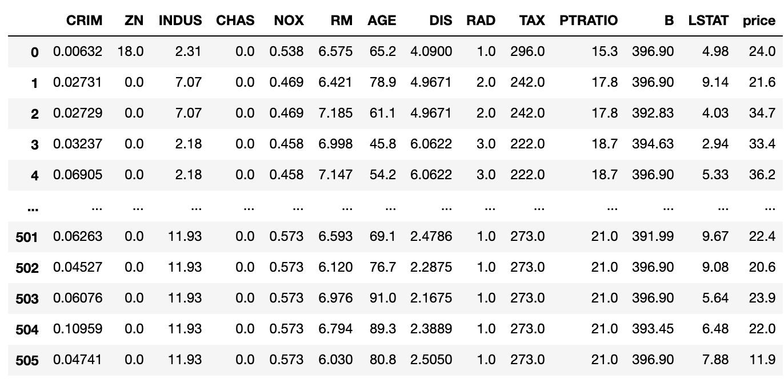
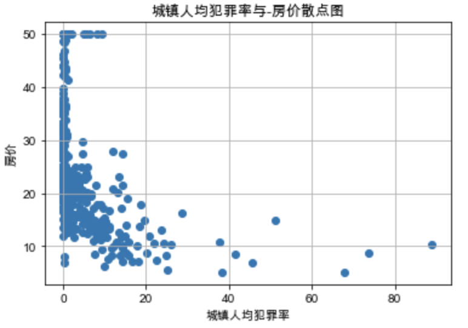

# Machine Learning学习笔记

## 常用库函数

### pandas

[pandas API文档](https://pandas.pydata.org/pandas-docs/stable/reference/index.html)

```python
# 生成DataFrame
pandas.DataFrame(data=None, index=None, columns=None, dtype=None, copy=False)

# 显示开头的部分数据
DataFrame.head(n=5)

# 输出DataFrame的总结性信息
DataFrame.info(verbose=None, buf=None, max_cols=None, memory_usage=None, null_counts=None)

# 输出数据的描述性统计信息
DataFrame.describe(percentiles=None, include=None, exclude=None, datetime_is_numeric=False)
```


### matplotlib

`matplotlib`的默认字体无法显示中文，所以需要切换字体。在`Windows`下，可以切换到`SimHei`字体；在该字体中，负号无法正常显示，所以需要加入第二行的参数设置。

```python
import matplotlib.pyplot as plt
plt.rcParams['font.sans-serif']=['SimHei'] #用来正常显示中文标签
plt.rcParams['axes.unicode_minus']=False #用来正常显示负号
```

在`Mac`下，默认并没有`SimHei`字体，我们可以切换到`Arial Unicode MS`字体，同样可以显示中文：

```python
import matplotlib.pyplot as plt
plt.rcParams['font.sans-serif'] = ['Arial Unicode MS']
```


```python
# 散点图
# s:size c:color
matplotlib.pyplot.scatter(x, y, s=None, c=None, marker=None, cmap=None, norm=None, vmin=None, vmax=None, alpha=None, linewidths=None, verts=<deprecated parameter>, edgecolors=None, *, plotnonfinite=False, data=None, **kwargs)[source]

# 标题
matplotlib.pyplot.title(label, fontdict=None, loc=None, pad=None, *, y=None, **kwargs)

# x轴标签
matplotlib.pyplot.xlabel(xlabel, fontdict=None, labelpad=None, *, loc=None, **kwargs)[source]

# y轴标签
matplotlib.pyplot.ylabel(ylabel, fontdict=None, labelpad=None, *, loc=None, **kwargs)[source]

# 显示所有的figure
matplotlib.pyplot.show(*, block=None)
```


## LinearRegression

线性回归在`sklearn`的`linear_model`模块中，可以在头部导入：

```python
from sklearn.linear_model import LinearRegression
```

此外，还要导入一些工具库：

```python
import numpy as np
import matplotlib
import matplotlib.pyplot as plt
import pandas as pd
```

在`sklearn`中有一个`datasets`模块，该模块中可以直接导入很多常用的数据集，这里我们使用波士顿房价的数据集：

```python
from sklearn.datasets import load_boston
```

下面就开始导入数据：

```python
data = load_boston()
```

得到的`data`是一个字典，其中包括：

- `data`：自变量数据
- `target`：因变量数据
- `feature_names`：每一个自变量的名字
- `DESCR`：该数据集的描述信息
- `filename`：数据集在本地的存储位置

为了方便操作数据，可以将数据转成`pandas.DataFrame`结构：

```python
# DataFrame是一个表格的样式，第一个参数传入数据，columns是每一列数据的名字
df = pd.DataFrame(data.data,columns=data.feature_names)
# 可以直接将变量名当做索引来得到数据，若没有该索引则可以新建一个
# 下列操作可以直接将因变量-房价，放到名为price的列中
df['price'] = data.target
```

得到的`DataFrame`如下：



为了方便看自变量和因变量的关系，可以通过散点图来直观观察：

```python
# 更换能显示中文的字体
plt.rcParams['font.sans-serif'] = ['Arial Unicode MS']
# 以CRIM为x轴，price为y轴画散点图
plt.scatter(df['CRIM'], data['price'])
# 设置图的标题
plt.title('城镇人均犯罪率与-房价散点图')
# 设置x轴的标题
plt.xlabel('城镇人均犯罪率')
# 设置y轴的标题
plt.ylabel('房价')
# 显示网格
plt.grid()
# 显示图像
plt.show()
```

得到结果如下：



同样的方法，可以观察其他变量之间的关系。

模型拟合很简单：

```python
lm = LinearRegression()
# 拟合数据
lm.fit(train_X,train_Y)
```

拟合完成之后，可以查看模型的参数：

```python
# 不同特征变量的系数
lm.coef_
# 拟合模型的截距
lm.intercept_
# R squre
lm.score(X, y)
```

此外，还可以直接用该模型预测新的值：

```python
test_y = lm.predict(test_X)
```

为了更客观、更有说服力，可以将数据分成训练集和测试集：

```python
train_X,test_X,train_Y,test_Y = train_test_split(X,y,test_size=0.2)
```

此外，`sklearn`中也自带交叉验证的方法：

```python
kf = KFold(n_splits=5, shuffle=True)
scores = cross_val_score(linear_model, X, y, cv=kf)
```

`scores`中有`n_splits`个元素，即`n_splits`次`KFold`得到的$R^2$。


## Logistic regression

`sklearn`中`logistic regression`的函数：

```python
sklearn.linear_model.LogisticRegression(penalty='l2', *, dual=False, tol=0.0001, C=1.0, 	fit_intercept=True, intercept_scaling=1, class_weight=None, random_state=None, 		
  solver='lbfgs', max_iter=100, multi_class='auto', verbose=0, warm_start=False, 	
  n_jobs=None, l1_ratio=None)
```

两个较为重要的参数：

- `solver`:**{‘newton-cg’, ‘lbfgs’, ‘liblinear’, ‘sag’, ‘saga’}, default=’lbfgs’**

  | 正则项 | Solver              |                                                              |
  | ------ | ------------------- | ------------------------------------------------------------ |
  | L1     | liblinear           | liblinear适用于小数据集；如果选择L2正则化发现还是过拟合，即预测效果差的时候，就可以考虑L1正则化；如果模型的特征非常多，希望一些不重要的特征系数归零，从而让模型系数稀疏化的话，也可以使用L1正则化。 |
  | L2     | liblinear           | libniear只支持多元逻辑回归的OvR，不支持MvM，但MVM相对精确。  |
  | L2     | lbfgs/newton-cg/sag | 较大数据集，支持one-vs-rest(OvR)和many-vs-many(MvM)两种多元逻辑回归。 |
  | L2     | sag                 | 如果样本量非常大，比如大于10万，sag是第一选择；但不能用于L1正则化。 |

- `multi_class`:**{‘auto’, ‘ovr’, ‘multinomial’}, default=’auto’**

`ovr`和`multinomial`的[详细介绍](https://blog.csdn.net/keeppractice/article/details/107088538)来自一篇博客，防止网站丢失，部分内容摘抄如下

### 多分类Logistic

#### 前言

逻辑回归分类器（Logistic Regression Classifier）是机器学习领域著名的分类模型。其常用于解决二分类（Binary Classification）问题。
利用二分类学习器进行的多分类学习可以分为三种策略：

一对一 （One vs. One, 简称OvO）
一对其余 （One vs. Rest，简称 OvR）也可是OvA（One vs. All）但是不严格
多对多（Many vs. Many，简称 MvM）

#### One-VS-Rest

假设我们要解决一个分类问题，该分类问题有三个类别，分别用△，□和×表示，每个实例（Entity）有两个属性（Attribute），如果把属性 1 作为 X 轴，属性 2 作为 Y 轴，训练集（Training Dataset）的分布可以表示为下图：


One-Vs-Rest 的思想是把一个多分类的问题变成多个二分类的问题。转变的思路就如同方法名称描述的那样，选择其中一个类别为正类（Positive），使其他所有类别为负类（Negative）。比如第一步，我们可以将三角形所代表的实例全部视为正类，其他实例全部视为负类，得到的分类器如图：


同理我们把 X 视为正类，其他视为负类，可以得到第二个分类器：


最后，第三个分类器是把正方形视为正类，其余视为负类：


对于一个三分类问题，我们最终得到 3 个二元分类器。在预测阶段，每个分类器可以根据测试样本，得到当前正类的概率。即 P(y = i | x; θ)，i = 1, 2, 3。选择计算结果最高的分类器，其正类就可以作为预测结果。

**One-Vs-Rest** 最为一种常用的二分类拓展方法，其优缺点也十分明显。

优点：普适性还比较广，可以应用于能输出值或者概率的分类器，同时效率相对较好，有多少个类别就训练多少个分类器。

缺点：很容易造成训练集样本数量的不平衡（Unbalance），尤其在类别较多的情况下，经常容易出现正类样本的数量远远不及负类样本的数量，这样就会造成分类器的偏向性。

#### One-Vs-One

相比于 One-Vs-Rest 由于样本数量可能的偏向性带来的不稳定性，One-Vs-One 是一种相对稳健的扩展方法。对于同样的三分类问题，我们像举行车轮作战一样让不同类别的数据两两组合训练分类器，可以得到 3 个二元分类器。

它们分别是三角形与 x 训练得出的分类器：


三角形与正方形训练的出的分类器：


以及正方形与 x 训练得出的分类器：


假如我们要预测的一个数据在图中红色圆圈的位置，那么第一个分类器会认为它是 x，第二个分类器会认为它偏向三角形，第三个分类器会认为它是 x，经过三个分类器的投票之后，可以预测红色圆圈所代表的数据的类别为 x。

任何一个测试样本都可以通过分类器的投票选举出预测结果，这就是 One-Vs-One 的运行方式。

当然这一方法也有显著的优缺点，其缺点是训练出更多的 Classifier，会影响预测时间。

虽然在本文的例子中，One-Vs-Rest 和 One-Vs-One 都得到三个分类器，但实际上仔细思考就会发现，如果有 k 个不同的类别，对于 One-Vs-Rest 来说，一共只需要训练 k 个分类器，而 One-Vs-One 则需训练 C(k, 2) 个分类器，只是因为在本例种，k = 3 时恰好两个值相等，一旦 k 值增多，One-Vs-One 需要训练的分类器数量会大大增多。

当然 One-Vs-One 的优点也很明显，它在一定程度上规避了数据集 unbalance 的情况，性能相对稳定，并且需要训练的模型数虽然增多，但是每次训练时训练集的数量都降低很多，其训练效率会提高。

#### 比较 OvO 和 OvR


容易看出，OvR只需训练N个分类器，而OvO则需要训练N(N-1)/2个分类器，因此，**OvO的存储开销和测试时间开销通常比OvR更大**。但在训练时，OvR的每个分类器均使用全部的训练样例，而OvO的每个分类器仅用到两个类的样例，因此，**在类别很多的时候，OvO的训练时间开销通常比OvR更小**。至于预测性能，则取决于具体的数据分布，在多数情况下两者差不多。

#### 多对多 （Many vs Many）

多对多是每次将若干类作为正例，若干其他类作为负例。MvM的正反例构造有特殊的设计，不能随意选取。我们这里介绍一种常用的MvM技术：纠错输出码（EOOC）。

- 编码：对N个类做M次划分，每次划分将一部分类别划分为正例，一部分划分为反例，从而形成一个二分类的训练集：这样共有M个训练集，则可训练出M个分类器。
- 解码：M个分类器分别对测试样本进行预测，这些预测样本组成一个编码。将这个编码与每个类各自的编码进行比较，返回其中距离最小的类别作为最终预测结果。

类别划分通过"编码矩阵" (coding matrix) 指定.编码矩阵有多种形式，**常见的主要有二元码 [Dietterich and iri 1995] 和三元码 [Allwein et al.,2000]**. 前者将每个类别分别指定为正类和反类，**后者在正、反类之外，还可指定"停用类"**因 3.5 给出了一个示意图，在图 3.5(a) 中，分类器 Cl 类和C3 类的样例作为正例 C2 类和 C4 类的样例作为反例;在图 3.5(b) 中，分类器14 类和 C4 类的样例作为正例 C3 类的样例作为反例.在解码阶段，各分类器的预测结果联合起来形成了测试示例的编码，该编码与各类所对应的编码进行比较?将距离最小的编码所对应的类别作为预测结果.例如在图 3.5(a) 中，若基于欧民距离，预测结果将是 C3.


为什么要用纠错输出码呢？因为在测试阶段，ECOC编码对分类器的错误有一定的容忍和修正能力。例如上图中对测试示例正确的预测编码是（-1，1，1，-1，1），但在预测时f2出错从而导致了错误的编码（-1， -1， 1， -1，1）。但是基于这个编码仍然能产生正确的最终分类结果C3。


### 标准化和归一化

`sklearn.processing`中有标准化和归一化的函数：

```python
# 标准化
sklearn.preprocessing.StandardScaler(*, copy=True, with_mean=True, with_std=True)

# 归一化
sklearn.preprocessing.MinMaxScaler(feature_range=(0, 1), *, copy=True)

# Methods
fit(X[, y]) # Compute the mean and std to be used for later scaling.
fit_transform(X[, y]) # Fit to data, then transform it.
get_params([deep]) # Get parameters for this estimator.
inverse_transform(X[, copy]) # Scale back the data to the original representation
partial_fit(X[, y]) # Online computation of mean and std on X for later scaling.
set_params(**params) # Set the parameters of this estimator.
transform(X[, copy]) # Perform standardization by centering and scaling
```


### 鸢尾花分类

同样的，`sklearn.datasets`中有`iris`的数据集：

```python
from sklearn.datasets import load_iris
data = load_iris()
```

数据的使用方法与`linearRegression`部分相同。

主要代码部分：

```python
lm = LogisticRegression(max_iter=2000, solver="sag")
X = data.data
y = data.target
lm.fit(X, y)
```

默认的`max_iter=100`在这里不能达到收敛状态，这里提高到了`2000`。

拟合完之后，查看正确率：

```python
lm.score(X, y)
```

> 0.98


待补充：

- 用`np.meshgrid`画分类结果图


## decisionTree

决策树可以调节的参数比较多，具体如下：

```python
sklearn.tree.DecisionTreeClassifier(*, criterion='gini', splitter='best', max_depth=None, min_samples_split=2, min_samples_leaf=1, min_weight_fraction_leaf=0.0, max_features=None, random_state=None, max_leaf_nodes=None, min_impurity_decrease=0.0, min_impurity_split=None, class_weight=None, presort='deprecated', ccp_alpha=0.0)

```

参数解释：

- criterion：分裂节点所用的标准，可选“gini”, “entropy”，默认“gini”。

- splitter：用于在每个节点上选择拆分的策略。可选“best”, “random”，默认“best”。
- max_depth：树的最大深度。如果为None，则将节点展开，直到所有叶子都是纯净的(只有一个类)，或者直到所有叶子都包含少于min_samples_split个样本。默认是None。
- min_samples_split：拆分内部节点所需的最少样本数：如果为int，则将min_samples_split视为最小值。如果为float，则min_samples_split是一个分数，而ceil（min_samples_split * n_samples）是每个拆分的最小样本数。默认是2。
- min_samples_leaf：在叶节点处需要的最小样本数。仅在任何深度的分割点在左分支和右分支中的每个分支上至少留下min_samples_leaf个训练样本时，才考虑。这可能具有平滑模型的效果，尤其是在回归中。如果为int，则将min_samples_leaf视为最小值。如果为float，则min_samples_leaf是分数，而ceil（min_samples_leaf * n_samples）是每个节点的最小样本数。默认是1。
- min_weight_fraction_leaf：在所有叶节点处（所有输入样本）的权重总和中的最小加权分数。如果未提供sample_weight，则样本的权重相等。
- max_features：寻找最佳分割时要考虑的特征数量：如果为int，则在每个拆分中考虑max_features个特征。如果为float，则max_features是一个分数，并在每次拆分时考虑int（max_features * n_features）个特征。如果为“auto”，则max_features = sqrt（n_features）。如果为“ sqrt”，则max_features = sqrt（n_features）。如果为“ log2”，则max_features = log2（n_features）。如果为None，则max_features = n_features。注意：在找到至少一个有效的节点样本分区之前，分割的搜索不会停止，即使它需要有效检查多个max_features功能也是如此。
- random_state：随机种子，负责控制分裂特征的随机性，为整数。默认是None。
- max_leaf_nodes：最大叶子节点数，整数，默认为None
- min_impurity_decrease：如果分裂指标的减少量大于该值，则进行分裂。
- min_impurity_split：决策树生长的最小纯净度。默认是0。自版本0.19起不推荐使用：不推荐使用min_impurity_split，而建议使用0.19中的min_impurity_decrease。min_impurity_split的默认值在0.23中已从1e-7更改为0，并将在0.25中删除。
- class_weight：每个类的权重，可以用字典的形式传入{class_label: weight}。如果选择了“balanced”，则输入的权重为n_samples / (n_classes * np.bincount(y))。
- presort：此参数已弃用，并将在v0.24中删除。
- ccp_alpha：将选择成本复杂度最大且小于ccp_alpha的子树。默认情况下，不执行修剪。


| method                                                       |                                                              |
| ------------------------------------------------------------ | ------------------------------------------------------------ |
| [`apply`](https://scikit-learn.org/stable/modules/generated/sklearn.tree.DecisionTreeClassifier.html#sklearn.tree.DecisionTreeClassifier.apply)(X[, check_input]) | Return the index of the leaf that each sample is predicted as. |
| [`cost_complexity_pruning_path`](https://scikit-learn.org/stable/modules/generated/sklearn.tree.DecisionTreeClassifier.html#sklearn.tree.DecisionTreeClassifier.cost_complexity_pruning_path)(X, y[, …]) | Compute the pruning path during Minimal Cost-Complexity Pruning. |
| [`decision_path`](https://scikit-learn.org/stable/modules/generated/sklearn.tree.DecisionTreeClassifier.html#sklearn.tree.DecisionTreeClassifier.decision_path)(X[, check_input]) | Return the decision path in the tree.                        |
| [`fit`](https://scikit-learn.org/stable/modules/generated/sklearn.tree.DecisionTreeClassifier.html#sklearn.tree.DecisionTreeClassifier.fit)(X, y[, sample_weight, check_input, …]) | Build a decision tree classifier from the training set (X, y). |
| [`get_depth`](https://scikit-learn.org/stable/modules/generated/sklearn.tree.DecisionTreeClassifier.html#sklearn.tree.DecisionTreeClassifier.get_depth)() | Return the depth of the decision tree.                       |
| [`get_n_leaves`](https://scikit-learn.org/stable/modules/generated/sklearn.tree.DecisionTreeClassifier.html#sklearn.tree.DecisionTreeClassifier.get_n_leaves)() | Return the number of leaves of the decision tree.            |
| [`get_params`](https://scikit-learn.org/stable/modules/generated/sklearn.tree.DecisionTreeClassifier.html#sklearn.tree.DecisionTreeClassifier.get_params)([deep]) | Get parameters for this estimator.                           |
| [`predict`](https://scikit-learn.org/stable/modules/generated/sklearn.tree.DecisionTreeClassifier.html#sklearn.tree.DecisionTreeClassifier.predict)(X[, check_input]) | Predict class or regression value for X.                     |
| [`predict_log_proba`](https://scikit-learn.org/stable/modules/generated/sklearn.tree.DecisionTreeClassifier.html#sklearn.tree.DecisionTreeClassifier.predict_log_proba)(X) | Predict class log-probabilities of the input samples X.      |
| [`predict_proba`](https://scikit-learn.org/stable/modules/generated/sklearn.tree.DecisionTreeClassifier.html#sklearn.tree.DecisionTreeClassifier.predict_proba)(X[, check_input]) | Predict class probabilities of the input samples X.          |
| [`score`](https://scikit-learn.org/stable/modules/generated/sklearn.tree.DecisionTreeClassifier.html#sklearn.tree.DecisionTreeClassifier.score)(X, y[, sample_weight]) | Return the mean accuracy on the given test data and labels.  |
| [`set_params`](https://scikit-learn.org/stable/modules/generated/sklearn.tree.DecisionTreeClassifier.html#sklearn.tree.DecisionTreeClassifier.set_params)(**params) | Set the parameters of this estimator.                        |


决策树直接拟合比较容易过拟合，最好调节以下参数或者进行`cross_validate`

```python
from sklearn.model_selection import train_test_split, cross_val_score
from sklearn.tree import DecisionTreeClassifier
dtc = DecisionTreeClassifier(criterion='gini', 
                             splitter='best', 
                             max_depth=None, 
                             min_samples_split=2, 
                             min_samples_leaf=1, 
                             min_weight_fraction_leaf=0.0, 
                             max_features=None, 
                             random_state=1, 
                             max_leaf_nodes=None, 
                             min_impurity_decrease=0.0, 
                             min_impurity_split=None, 
                             class_weight=None, 
                             presort='deprecated', 
                             ccp_alpha=0.0)
scores = cross_val_score(dtc, X, y)                           
```


它是个树，不能可视化可就太难受了，这里用`graphviz`来进行可视化。

安装：

```shell
conda install python-graphviz
```

使用：

```python
import graphviz
from sklearn import tree
clf = tree.DecisionTreeClassifier()
dot_data = tree.export_graphviz(clf, out_file=None,  
                         feature_names=iris.feature_names,  
                         class_names=iris.target_names,  
                         filled=True, rounded=True,  
                         special_characters=True)  
graph = graphviz.Source(dot_data)  
graph 
```


## naiveBayesian


### 文字特征向量化

在对文本内容进行处理之前，往往需要分词（中文）和特征向量化。

这里使用英文数据，暂不考虑分词；在`sklearn`中，主要有两种文本特征向量化的方法：

#### CountVectorizer

```python
# count vectorizer
sklearn.feature_extraction.text.CountVectorizer(*, input='content', encoding='utf-8', decode_error='strict', strip_accents=None, lowercase=True, preprocessor=None, tokenizer=None, stop_words=None, token_pattern='(?u)\b\w\w+\b', ngram_range=(1, 1), analyzer='word', max_df=1.0, min_df=1, max_features=None, vocabulary=None, binary=False, dtype=<class 'numpy.int64'>)
```

[参数详细解释](https://blog.csdn.net/weixin_38278334/article/details/82320307)

`CountVectorizer()`函数只考虑每个单词出现的频率；然后构成一个特征矩阵，每一行表示一个训练文本的词频统计结果。该方法又称为**词袋法(Bag of Words)**。


#### TfidfVectorizer

```python
# Tfidf Vectorizer
sklearn.feature_extraction.text.TfidfVectorizer(*, input='content', encoding='utf-8', decode_error='strict', strip_accents=None, lowercase=True, preprocessor=None, tokenizer=None, analyzer='word', stop_words=None, token_pattern='(?u)\b\w\w+\b', ngram_range=(1, 1), max_df=1.0, min_df=1, max_features=None, vocabulary=None, binary=False, dtype=<class 'numpy.float64'>, norm='l2', use_idf=True, smooth_idf=True, sublinear_tf=False)
```

TF：词频:
$$
TF(w)=\frac{词w在文档中出现的次数}{文档的总词数}
$$


IDF：逆向文件频率。有些词可能在文本中频繁出现，但并不重要，也即信息量小，如is,of,that这些单词，这些单词在语料库中出现的频率也非常大，我们就可以利用这点，降低其权重。
$$
IDF(w)=\log\frac{语料库的总文档数}{语料库中词w出现的文档数}
$$
将上面的TF-IDF相乘就得到了综合参数：
$$
TF-IDF=TF*IDF
$$


### 垃圾邮件分类

根据对特征分布假设的不同，常用的有三种朴素贝叶斯模型：

```python
# 多项分布
sklearn.naive_bayes.MultinomialNB(*, alpha=1.0, fit_prior=True, class_prior=None)
# 伯努利分布
sklearn.naive_bayes.BernoulliNB(*, alpha=1.0, binarize=0.0, fit_prior=True, class_prior=None)
# 高斯分布
sklearn.naive_bayes.GaussianNB(*, priors=None, var_smoothing=1e-09)
```

常用方法如下：

**Methods**

|                                                              |                                                             |
| ------------------------------------------------------------ | ----------------------------------------------------------- |
| [`fit`](https://scikit-learn.org/stable/modules/generated/sklearn.naive_bayes.GaussianNB.html#sklearn.naive_bayes.GaussianNB.fit)(X, y[, sample_weight]) | Fit Gaussian Naive Bayes according to X, y                  |
| [`partial_fit`](https://scikit-learn.org/stable/modules/generated/sklearn.naive_bayes.GaussianNB.html#sklearn.naive_bayes.GaussianNB.partial_fit)(X, y[, classes, sample_weight]) | Incremental fit on a batch of samples.                      |
| [`predict`](https://scikit-learn.org/stable/modules/generated/sklearn.naive_bayes.GaussianNB.html#sklearn.naive_bayes.GaussianNB.predict)(X) | Perform classification on an array of test vectors X.       |
| [`predict_proba`](https://scikit-learn.org/stable/modules/generated/sklearn.naive_bayes.GaussianNB.html#sklearn.naive_bayes.GaussianNB.predict_proba)(X) | Return probability estimates for the test vector X.         |
| [`score`](https://scikit-learn.org/stable/modules/generated/sklearn.naive_bayes.GaussianNB.html#sklearn.naive_bayes.GaussianNB.score)(X, y[, sample_weight]) | Return the mean accuracy on the given test data and labels. |


这里使用`SMSSpamCollection`数据集

具体代码：

```python
import pandas as pd
from sklearn.feature_extraction.text import TfidfVectorizer
from sklearn.feature_extraction.text import CountVectorizer
from sklearn.naive_bayes import MultinomialNB,BernoulliNB,GaussianNB
from sklearn.metrics import classification_report
from sklearn.model_selection import  train_test_split, cross_val_score

# 读取数据
sms = pd.read_csv('./dataset/SMSSpamCollection', sep='\t', header=None)
data = sms.loc[:,1]
target = sms.loc[:,0]

# 划分数据集
X_train, X_test, y_train, y_test = train_test_split(data, target)

# 向量化
vec = CountVectorizer()
X_train = vec.fit_transform(X_train)
X_test = vec.transform(X_test)

# 拟合模型
clf = MultinomialNB()
clf.fit(X_train, y_train)
clf.score(X_test, y_test)
```


## SVM

比较好的几个算法介绍

[第一个](https://zhuanlan.zhihu.com/p/77750026)   [第二个](https://zhuanlan.zhihu.com/p/40857202)


接口如下：

```python
sklearn.svm.SVC(*, C=1.0, kernel='rbf', degree=3, gamma='scale', coef0=0.0, shrinking=True, probability=False, tol=0.001, cache_size=200, class_weight=None, verbose=False, max_iter=-1, decision_function_shape='ovr', break_ties=False, random_state=None)
```

核函数和参数的对应关系：

- linear: $⟨x,x′⟩$.

- polynomial: $(γ⟨x,x′⟩+r)^d$, where d is specified by parameter `degree`, r by `coef0`.

- rbf: $\exp⁡(−γ∥x−x′∥^2)$, where γ is specified by parameter `gamma`, must be greater than 0.

- sigmoid: $tanh⁡(γ⟨x,x′⟩+r)$, where r is specified by `coef0`.


$C$和$\gamma$的简单理解：

- $C$越大，越容易过拟合；$\gamma$越大，越容易过拟合


### 人脸识别

代码中涉及到了用`PCA`提取`eigenface`来降维，不提取`eigenface`的画分类结果特别差

```python
import matplotlib.pyplot as plt
from sklearn.model_selection import train_test_split
from sklearn.model_selection import GridSearchCV
from sklearn.datasets import fetch_lfw_people
from sklearn.metrics import classification_report
from sklearn.metrics import confusion_matrix
from sklearn.decomposition import PCA
from sklearn.svm import SVC

lfw_people = fetch_lfw_people(min_faces_per_person=50)

# introspect the images arrays to find the shapes (for plotting)
n_samples, h, w = lfw_people.images.shape

# for machine learning we use the 2 data directly (as relative pixel
# positions info is ignored by this model)
X = lfw_people.data
n_features = X.shape[1]

# the label to predict is the id of the person
y = lfw_people.target
target_names = lfw_people.target_names
n_classes = target_names.shape[0]

print("Total dataset size:")
print("n_samples: %d" % n_samples)
print("n_features: %d" % n_features)
print("n_classes: %d" % n_classes)

# split into a training and testing set
X_train, X_test, y_train, y_test = train_test_split(
    X, y, test_size=0.25, random_state=42)

# #############################################################################
# Compute a PCA (eigenfaces) on the face dataset (treated as unlabeled
# dataset): unsupervised feature extraction / dimensionality reduction
n_components = 150

print("Extracting the top %d eigenfaces from %d faces"
      % (n_components, X_train.shape[0]))
t0 = time()
pca = PCA(n_components=n_components, svd_solver='randomized',
          whiten=True).fit(X_train)
print("done in %0.3fs" % (time() - t0))

eigenfaces = pca.components_.reshape((n_components, h, w))

print("Projecting the input data on the eigenfaces orthonormal basis")
t0 = time()
X_train_pca = pca.transform(X_train)
X_test_pca = pca.transform(X_test)
print("done in %0.3fs" % (time() - t0))

# #############################################################################
# Train a SVM classification model

print("Fitting the classifier to the training set")
t0 = time()
param_grid = {'C': [1e3, 5e3, 1e4, 5e4, 1e5],
              'gamma': [0.0001, 0.0005, 0.001, 0.005, 0.01, 0.1], }
clf = GridSearchCV(
    SVC(kernel='rbf', class_weight='balanced', verbose=True), 
    param_grid, 
    verbose=1,
    n_jobs=-1
)
clf = clf.fit(X_train_pca, y_train)
print("done in %0.3fs" % (time() - t0))
print("Best estimator found by grid search:")
print(clf.best_estimator_)

# #############################################################################
# Quantitative evaluation of the model quality on the test set

print("Predicting people's names on the test set")
t0 = time()
y_pred = clf.predict(X_test_pca)
print("done in %0.3fs" % (time() - t0))

print(classification_report(y_test, y_pred, target_names=target_names))
print(confusion_matrix(y_test, y_pred, labels=range(n_classes)))

# #############################################################################
# Qualitative evaluation of the predictions using matplotlib

def plot_gallery(images, titles, h, w, n_row=3, n_col=4):
    """Helper function to plot a gallery of portraits"""
    plt.figure(figsize=(1.8 * n_col, 2.4 * n_row))
    plt.subplots_adjust(bottom=0, left=.01, right=.99, top=.90, hspace=.35)
    for i in range(n_row * n_col):
        plt.subplot(n_row, n_col, i + 1)
        plt.imshow(images[i].reshape((h, w)), cmap=plt.cm.gray)
        plt.title(titles[i], size=12)
        plt.xticks(())
        plt.yticks(())


# plot the result of the prediction on a portion of the test set

def title(y_pred, y_test, target_names, i):
    pred_name = target_names[y_pred[i]].rsplit(' ', 1)[-1]
    true_name = target_names[y_test[i]].rsplit(' ', 1)[-1]
    return 'predicted: %s\ntrue:      %s' % (pred_name, true_name)

prediction_titles = [title(y_pred, y_test, target_names, i)
                     for i in range(y_pred.shape[0])]

plot_gallery(X_test, prediction_titles, h, w)

# plot the gallery of the most significative eigenfaces

eigenface_titles = ["eigenface %d" % i for i in range(eigenfaces.shape[0])]
plot_gallery(eigenfaces, eigenface_titles, h, w)

plt.show()
```


## sklearn中对数据的处理

### 划分训练集/测试集

[API链接](https://scikit-learn.org/stable/modules/generated/sklearn.model_selection.train_test_split.html?highlight=train_test#sklearn.model_selection.train_test_split)

```python
X_train,X_test, y_train, y_test = sklearn.model_selection.train_test_split(train_data,train_target,test_size=0.25)
```


### KFold

```python
sklearn.model_selection.KFold(n_splits=5, *, shuffle=False, random_state=None)

# 用法示例
import numpy as np
from sklearn.model_selection import KFold
X = np.array([[1, 2], [3, 4], [1, 2], [3, 4]])
y = np.array([1, 2, 3, 4])
kf = KFold(n_splits=2)
kf.get_n_splits(X)

print(kf)

for train_index, test_index in kf.split(X):
    print("TRAIN:", train_index, "TEST:", test_index)
    X_train, X_test = X[train_index], X[test_index]
    y_train, y_test = y[train_index], y[test_index]
```


### Cross-Validation

[API链接](https://scikit-learn.org/stable/modules/generated/sklearn.model_selection.cross_validate.html?highlight=cross_validation)

```python
sklearn.model_selection.cross_validate(estimator, X, y=None, *, groups=None, scoring=None, cv=None, n_jobs=None, verbose=0, fit_params=None, pre_dispatch='2*n_jobs', return_train_score=False, return_estimator=False, error_score=nan)

# 用法示例
>>> from sklearn import datasets, linear_model
>>> from sklearn.model_selection import cross_validate
>>> from sklearn.metrics import make_scorer
>>> from sklearn.metrics import confusion_matrix
>>> from sklearn.svm import LinearSVC
>>> diabetes = datasets.load_diabetes()
>>> X = diabetes.data[:150]
>>> y = diabetes.target[:150]
>>> lasso = linear_model.Lasso()

>>> cv_results = cross_validate(lasso, X, y, cv=3)
>>> sorted(cv_results.keys())
['fit_time', 'score_time', 'test_score']
>>> cv_results['test_score']
array([0.33150734, 0.08022311, 0.03531764])

# 也可以直接得到scores
scores = sklearn.model_selection.cross_val_score(estimator, X, y=None, *, groups=None, scoring=None, cv=None, n_jobs=None, verbose=0, fit_params=None, pre_dispatch='2*n_jobs', error_score=nan)[source]
```


### confusion_matrix

用于评估分类器

```python
sklearn.metrics.confusion_matrix(y_true, y_pred, *, labels=None, sample_weight=None, normalize=None)
```

[混淆矩阵是什么？](https://www.cnblogs.com/zxyza/p/10059834.html)


### classification_report

用于评估分类结果

```python
sklearn.metrics.classification_report(y_true, y_pred, *, labels=None, target_names=None, sample_weight=None, digits=2, output_dict=False, zero_division='warn')
```


输出参数意义：


```
precision = TP / (TP + FP)   # 预测为正的样本中实际正样本的比例
recall = TP / (TP + FN)      # 实际正样本中预测为正的比例
accuracy = (TP + TN) / (P + N)
F1-score = 2 / [(1 / precision) + (1 / recall)]
```


### GridSearch

自动调参的函数

```python
sklearn.model_selection.GridSearchCV(estimator, param_grid, *, scoring=None, n_jobs=None, iid='deprecated', refit=True, cv=None, verbose=0, pre_dispatch='2*n_jobs', error_score=nan, return_train_score=False)
```

样例代码：

```python
from sklearn import svm, datasets
from sklearn.model_selection import GridSearchCV
iris = datasets.load_iris()
parameters = {'kernel':('linear', 'rbf'), 'C':[1, 10]}
svc = svm.SVC()
clf = GridSearchCV(svc, parameters)
clf.fit(iris.data, iris.target)
```

常用属性：

- cv_results_ : dict of numpy (masked) ndarrays

具有键作为列标题和值作为列的dict，可以导入到DataFrame中。注意，“params”键用于存储所有参数候选项的参数设置列表。

- best_estimator_ : estimator

通过搜索选择的估计器，即在左侧数据上给出最高分数（或指定的最小损失）的估计器。 如果*refit = False*，则不可用。

- best_score_ : float best_estimator的分数

- best_params_ : dict 在保存数据上给出最佳结果的参数设置。

- grid_scores_：给出不同参数情况下的评价结果