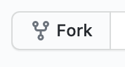
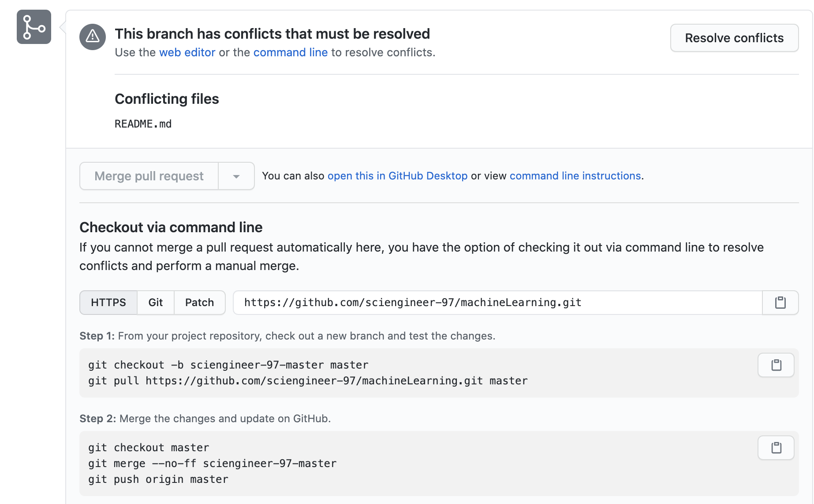
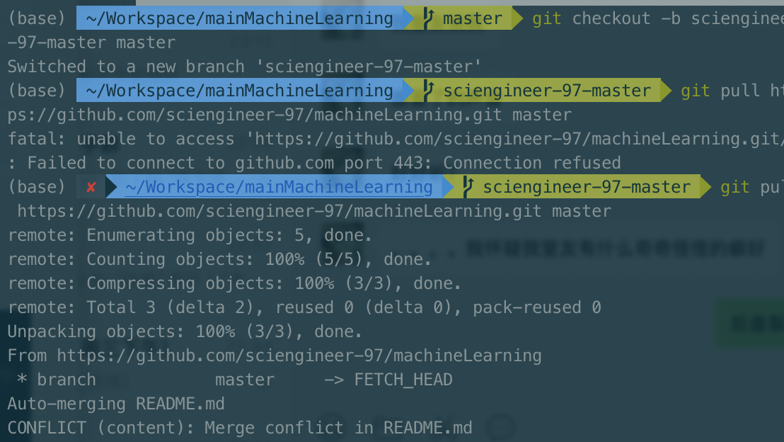
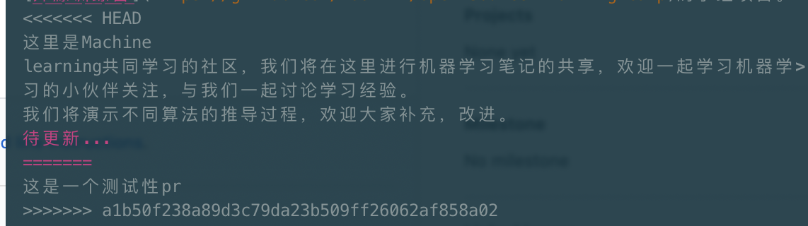
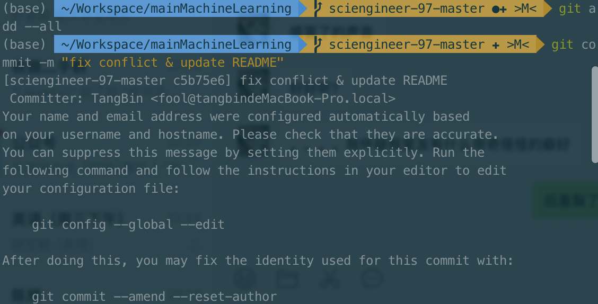
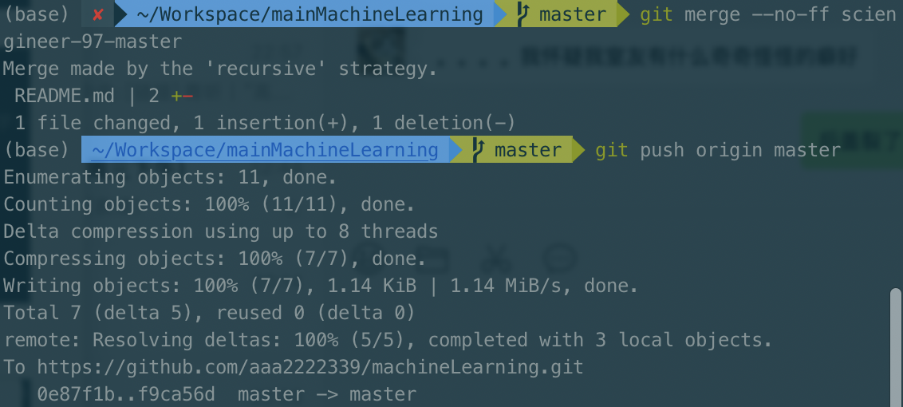
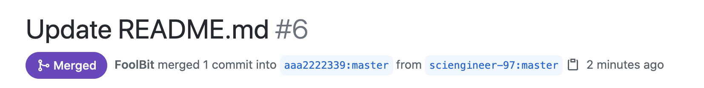

# Git 使用简单教程

## 基础操作

暂略

## PR相关操作

*内容总结自暑期特训营*

### 提交一个简单的PR

**1、fork别人的仓库**：不可能直接在别人的代码仓库中直接修改代码，你也没有这个权限，因此你可以fork一份（相当于单独复制一个分叉出来）到你自己名下的一个仓库中。



点击完`fork`按钮之后，在自己的仓库中就可以看到一个一模一样的项目了。

**2、将代码clone到本地**：代码通常是在开发者本地修改和调试的不可能直接在远程的仓库上开发，因此需要将你fork的代码下载到本地。这里的术语是clone（复制一份）到本地。

**3、修改代码**：在本地可以修改你的代码

**4、提交代码到你自己的仓库**：将修改好的代码先提交到你自己的仓库中

**5、提交PR**：在你自己的仓库中，将改动的那部分内容，向原项目仓库中提交一个请求（PR），申请将这部分改动合并到主仓库中


### 提交PR时，原始仓库已经更新过了怎么办？

原始仓库更新过了会出现两种情况，一种情况下与本地修改的内容产生冲突，另一种情况下没有冲突。

#### 无冲突

1.在本地仓库创建一个新分支，名字为branch-name，该分支名字可以自行确定

```
git checkout -b branch-name
```

2.将本地仓库与上游仓库内容进行同步

```shell
git remote add upstream git@github.com:XXXXX # 原始仓库
git fetch upstream master
git rebase upstream/master
```

3.个人分支推送到github

```
git push -f origin branch-name
```

4.提交PR
此时你会发现，你的个人github仓库中多了一个branch-name分支。
现在可以按照上次教程的步骤，基于branch-name分支来提交PR

5.在你的PR被成功合并后，还需要做如下清理和同步的工作

- 在本地的git bash客户端中的命令行执行如下命令删除远程分支：

```
git push origin --delete branch-name
```

- 检出并切换本地仓库的主分支（master）：

```
git checkout master -f
```

- 删除本地分支branch-name：

```
git branch -D branch-name
```

- 用最新的upstream版本来更新本地仓库的主分支（master）：

```
git pull --ff upstream master
```

至此，你的本地仓库的主分支（master）与远程仓库代码主分支（master）保持一致，并且删除了本地仓库和你个人github仓库中的branch-name分支了。


#### 有冲突

前面的操作都一样，区别在于`rebase`的时候。

```
git fetch upstream master
git rebase upstream/master
```


在内容冲突的情况下，无法顺利进行`rebase`，根据错误提示，解决对应的文件冲突即可。

解决完冲突并`git add`之后，执行指令`git rebase --contunue`，就可以继续执行`rebase`操作。至此就顺利与原始仓库完成合并了。

最后，把修改提交到仓库即可。

```
git push -f origin branch-name
```


清理工作：

- 在本地执行如下命令删除远程分支：

```
git push origin --delete branch-name
```

- 检出并切换本地仓库的主分支（master）：

```
git checkout master -f
```

- 删除本地分支branch-name：

```
git branch -D branch-name
```

- 用最新的upstream版本来更新本地仓库的主分支（master）：

```
git pull --ff upstream master
```

至此，你的本地仓库的主分支（master）与远程仓库代码主分支（master）保持一致，并且删除了本地仓库和你个人github仓库中的branch-name分支了。


## 接受PR时出现冲突咋办？

在PR界面，会提示你分支有冲突，需要解决。点击右下角的`command line instruction`，下面就会出现怎么解决冲突的提示：



上述指令都是要在仓库的文件夹里执行，执行结果如下：



可以看到，在`pull`的时候就失败了，看最下面的提示

> Merge conflict in README.md

在`README.md`中有冲突出现。因此，需要打开`READMD.md`文件解决冲突。



其中的`<<<<<<<`，`=======`，`>>>>>>>`用来分割两个不同版本的冲突部分，这三行直接删除就行，然后把剩下的部分适当调整修改。

解决完冲突之后，就可以将内容再次提交：





回到PR界面可以看到，PR已经被`Merged`了。

